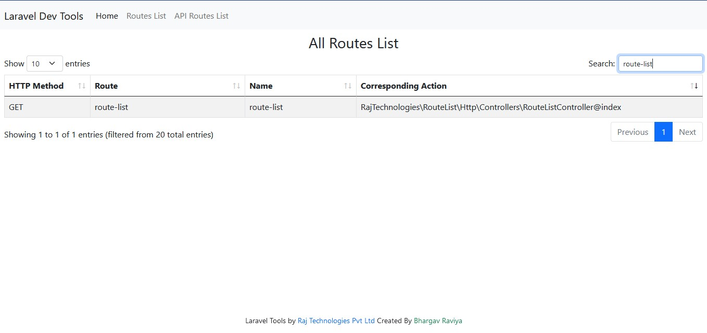

<br />
<div align="center">
    
<h1 align="center">Laravel Route List</h1>
  <p align="center">
    Show searchable, filterable Laravel application routes in blade view.
  </p>
<br><br>
</div>

## Installation

Install my-project with npm

```bash
  composer require rajtechnologies/laravel-route-list
```

Go On Web Brower 
```
  {base_url}/route-list
```
    
## Features

- Web Route List
- API Route List
- filter with Datatable of method, route , name and action 

## Screenshots




## Tech Stack

**Client:** Bootstrap, Datatables

**Server:** Laravel


## License

[MIT](LICENSE)
